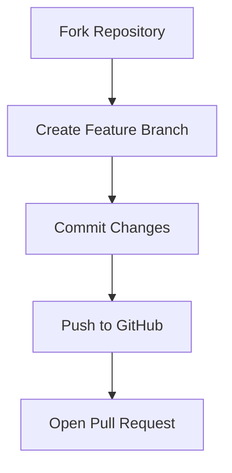

# 📬 Responsive Contact Page UI


---

## 🚀 Project Overview

A modern, responsive contact form user interface built entirely with **HTML5** and **CSS3**, showcasing neat design, Font Awesome icons, and a layout optimized for all screen sizes. This UI is ideal for use in portfolios, websites, or frontend UI/UX concepts.

---

## ✨ Key Features

| Feature               | Description                                                  |
|-----------------------|--------------------------------------------------------------|
| 📱 **Fully Responsive**     | Works perfectly on mobile, tablet, and desktop devices       |
| 🎨 **Stylish Layout**       | Clean flexbox-based layout with well-aligned elements       |
| 🔗 **Social Media Icons**   | Integrated with Font Awesome 6 social icons                 |
| 🧊 **Modern UI**            | Includes soft shadows, rounded corners, and smooth focus     |
| 💡 **Pure CSS Design**      | No JavaScript — built entirely with CSS for simplicity      |

---

## 🛠️ Technologies Used

- HTML5
- CSS3
- Font Awesome 6 (CDN)

---

## 📂 Project Structure

```bash
contact-page/
├── contact.html
├── style.css
├── istockphoto-541835638-612x612.jpg
└── README.md
````

---

## 🧩 Usage

```bash
# Clone the repository
git clone https://github.com/yourusername/contact-page-ui.git

# Navigate to the project directory
cd contact-page-ui

# Open with your browser
Double-click on contact.html
```

---

## 🤝 Contribution



Contributions, ideas, and suggestions are always welcome! 🌍

---

## 📜 License

This project is licensed under the **MIT License** – see the [LICENSE](./LICENSE) file for more information.

---

<div align="center">

Crafted with ❤️ by [YourName](https://github.com/yourusername)
*UI/UX Designer & Frontend Developer*

</div>
```


